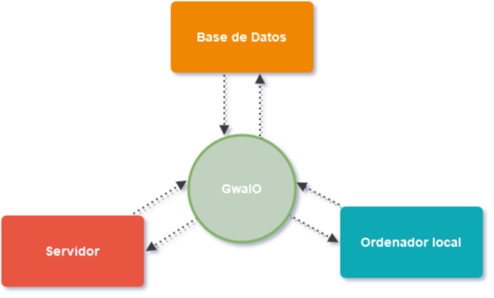

---
hide:
  - toc
  - navigation
---

  <video
    id="banner-video"
    class="banner-video"
    autoplay
    muted
    loop
    playsinline
    src="assets/video/gwaio_teaser.mp4"
    type="video/mp4"
  ></video>
  

    <h1>GwaIO</h1>
    
Potencia tu Pipeline

    <a class="btn" href="user/setup" target="_blank">User Guide</a>
    <a class="btn" href="dev/home"   target="_blank">Dev Guide</a>
  

**GwaIO es una aplicación de escritorio diseñada para optimizar y simplificar la producción audiovisual a través de potentes automatizaciones.**

{ align=right }

GwaIO actúa como un puente inteligente entre la estación de trabajo del artista, el servidor compartido y la base de datos del proyecto. Esto se traduce en un flujo de trabajo más ágil y eficiente, minimizando errores humanos y facilitando tareas cotidianas como:

  

<figure markdown="span">
  
</figure>

  

* **Creación de ficheros con el naming convention adecuado.**
* **Subida y gestión de archivos en servidor y base de datos.**
* **Exportación y guardado de ficheros de forma consistente.**
  

# **Beneficios Clave de GwaIO:**

  

-   :material-rocket:{ .lg .middle } __Aumento de la Productividad__

    ---

    Trabaja más rápido gracias a la automatización de tareas repetitivas y la simplificación del flujo de trabajo. GwaIO permite integrar herramientas y scripts que agilizan las tareas repetitivas.

-   :material-shield-check:{ .lg .middle } __Reducción de Errores__

    ---

    Minimiza el error humano al automatizar procesos críticos, garantizando resultados consistentes y de alta calidad.

-   :material-factory:{ .lg .middle } __Control de Producción Mejorado__

    ---

    Asegura que todo el material producido cumpla con los estándares establecidos y se almacene correctamente.

-   :material-currency-eur:{ .lg .middle } __Reducción de Costes__

    ---

    Integra utilidades que a menudo requieren software externo, como la sincronización de archivos local/servidor, reduciendo licencias y gastos operativos.

  

# **¿Cómo funciona GwaIO en la práctica?**

Se presenta a los artistas con una interfaz intuitiva, una lista clara de tareas pendientes. Además, facilita la generación de nuevos ficheros mediante la automatización de:

* **Nomenclatura de archivos.**
* **Recopilación automática de material de entrada de tareas previas.**
* **Publicación eficiente de nuevas versiones en la base de datos.**

Recopilacion de archivos de tarea previa < sincronizado de ficheros < Creación de archivo de version con naming correcto

  

# **Herramientas integradas**

**Unifica y controla tu pipeline con GwaIO**. Integra múltiples DCC de manera robusta y flexible. La arquitectura modular de GwaIO facilita la incorporación de cualquier software, adaptándose completamente a tus necesidades.

<link rel="stylesheet" href="https://cdnjs.cloudflare.com/ajax/libs/font-awesome/6.0.0/css/all.min.css">

  

    <a href="">
      
      

        <h3>Maya</h3>
        <i class="fas fa-check-circle"></i>
      

    </a>
  

  

    <a href="">
      
      

        <h3>Nuke</h3>
        <i class="fas fa-hourglass-half"></i>
      

    </a>
  

  

    <a href="">
      
      

        <h3>Deadline</h3>
        <i class="fas fa-check-circle"></i>
      

    </a>
  

  

    <a href="">
      
      

        <h3>FPT</h3>
        <i class="fas fa-check-circle"></i>
      

    </a>
  

  

    <a href="">
      
      

        <h3>Substance</h3>
        <i class="fas fa-check-circle"></i>
      

    </a>
  

  

    <a href="">
      
      

        <h3>Photoshop</h3>
        <i class="fas fa-hourglass-half"></i>
      

    </a>
  

# **Explora la Documentación:**

A lo largo de esta documentación, profundizaremos en cada una de estas funcionalidades y te guiaremos para sacar el máximo provecho de GwaIO en tu pipeline de producción 3D. [Comienza a explorar aquí](user/setup.md) 
