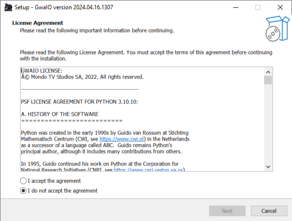
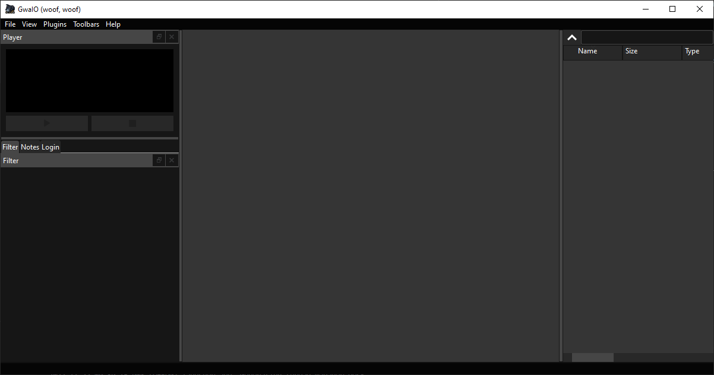
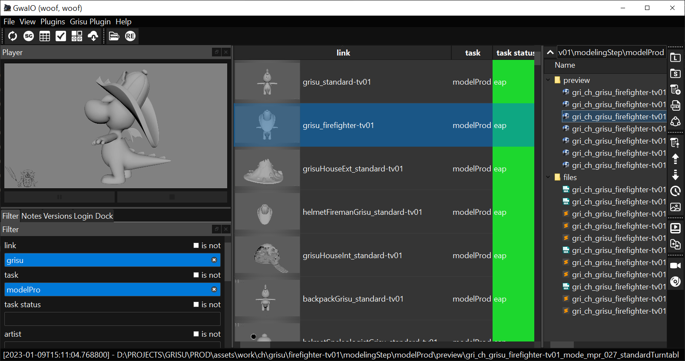
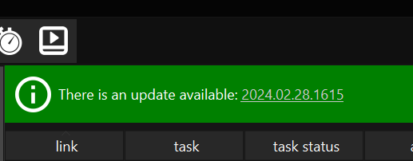

# Primeros pasos con GwaIO

## Requisitos mínimos del sistema 
Para ejecutar y utilizar GwaIO, el equipo donde esté instalado debe cumplir con las especificaciones técnicas mínimas que se indican a continuación:  

* Windows 10 de 64 bits (versión 21H2) o posterior

## Requisitos adicionales del sistema
GwaIO integra dentro de sí funcionalidades de otros programas, los cuales amplían el abanico de herramientas disponibles, aunque éstas no sean necesarias, es recomendable disponer de los siguientes programas para obtener sus las funcionalidades adicionales: 

* [RV](https://www.shotgridsoftware.com/rv/download/)
* [FFmpeg](https://ffmpeg.org/)

Además, si se quiere utilizar el sistema de sincronización que viene incluido con GwaIO, se deberá tener montado el recurso compartido que se utilice como carpeta raíz del proyecto. En Windows no será necesario ya que se utilizan rutas UNC, pero en Mac y Linux se debe montar el recurso raíz como disco Samba (SMB).  
En el caso de que el ordenador esté en remoto, se deberá acceder a la red a través de una VPN.

## Instalación
GwaIO se distribuye con un instalador. Haciendo doble click sobre el instalador se abrirá la interfaz de instalación del programa:
GwaIO se distribuye como una carpeta comprimida dentro de un fichero zip. Dentro de esta carpeta encontramos un archivo ".exe", el cual ejecuta el programa:

 

Deberá seguir los pasos del instalador para disponer del programa. Una vez finalizada la instalación, se podrá abrir GwaIO desde la carpeta de instalación, o desde el acceso directo creado en el escritorio (Si se habilitó la opción en la instalación). 

Cuando inicias GwaIO por primera vez, eres presentado con la siguiente interfaz:  

Como es natural, no tiene ningún dato cargado todavía, ya que para poder ver datos tienes que identificarte primero en la app.

### Ficheros de configuración
Actualmente GwaIO actualiza automáticamente dos ficheros que se encuentran en la ruta "%appdata%\GwaIO". Si no existen, se generaran automáticamente. Estos dos archivos son:

- **./gwaio.env**: contiene variables de entorno que GwaIO lee y modifica a través de una interfaz de fácil uso para el usuario. Este fichero puede ser modificado a mano si hace falta.
- **./usercfg.json**: contiene datos relativos a la sesion de usuario, como por ejemplo:
    * Últimos filtros utilizados en el **"Panel de Filtros"**
    * Último username y contraseña utilizados en el **Panel de Login**. Nota: la contraseña que se guarda está encriptada, de tal manera que abriendo éste fichero no revela ningún dato confidencial.
    * Último plugin utilizado.

## Inicialización del proyecto 
Una vez identificado como usuario en la aplicación, ya se puede tener acceso a los proyectos instalados en GwaIO. Para cargar un proyecto, haga clic en el menú desplegable llamado **"Menú de Plugins"**, el cual se encuentra en la **"Barra de Menús"** del programa, en la parte superior de la ventana principal. Haga clic en el plugin del proyecto que desea cargar. 

Cuando se inicializa un proyecto, el programa carga el plugin vinculado a este proyecto y a continuación carga automáticamente tanto las tareas del proyecto en el **"Panel de Tareas"**, como las barras de herramientas asociadas al mismo. 

## Espacio de trabajo 

La interfaz de usuario se divide en dos paneles principales, el **"Panel de Tareas"** y el **"Panel de Ficheros"**. Tiene además una **"Barra de Menús"** y una **"Barra de Estatus"**. 

Adicionalmente tiene otros paneles y barras de herramientas secundarias con funcionalidades adicionales que se pueden solapar entre sí, desacoplar de la ventana principal y reacoplar de nuevo, dando la posibilidad de customizar el espacio de trabajo. En los siguientes enlaces se puede encontrar información más en profundidad sobre los paneles y toolbars que nos encontramos en el espacio de trabajo. 

- [Paneles](/user/interface/panels.md)
- [Toolbars](/user/interface/toolbars.md)

## Actualización

En caso de que exista una actualización del programa, nos aparecerá un banner en la intefaz que lo indicará.

Haga clic en el número de versión para comenzar la actualización de GwaIO. No obstante, las actualizaciones se pueden revisar tambien a través de la **"Barra de Menús"**. Para ello, haga clic en **File > Update GwaIO**