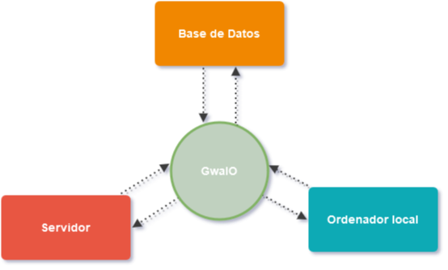

# GwaIO: Potencia tu Pipeline 3D

**GwaIO es una aplicación de escritorio diseñada para optimizar y simplificar la producción audiovisual a través de potentes automatizaciones.**

GwaIO actúa como un puente inteligente entre la estación de trabajo del artista, el servidor compartido y la base de datos del proyecto. Esto se traduce en un flujo de trabajo más ágil y eficiente, minimizando errores humanos y facilitando tareas cotidianas como:

* **Creación de ficheros con el naming convention adecuado.**
* **Subida y gestión de archivos en servidor y base de datos.**
* **Exportación y guardado de ficheros de forma consistente.**

**Beneficios Clave de GwaIO:**

* **Aumento de la Productividad:** Trabaja más rápido gracias a la automatización de tareas repetitivas y la simplificación del flujo de trabajo. GwaIO permite integrar herramientas y scripts que permiten agilizar las tareas que sean repetitivas
* **Reducción de Errores:** Minimiza el error humano al automatizar procesos críticos.
* **Control de Producción Mejorado:** Asegura que todo el material producido cumpla con los estándares establecidos y se almacene correctamente.
* **Reducción de Costes:** Integra utilidades que a menudo requieren software externo, como la sincronización de archivos local/server.

**¿Cómo funciona GwaIO en la práctica?**

Se presenta a los artistas con una interfaz intuitiva, una lista clara de tareas pendientes. Además, facilita la generación de nuevos ficheros mediante la automatización de:

* **Nomenclatura de archivos.**
* **Recopilación automática de material de entrada de tareas previas.**
* **Publicación eficiente de nuevas versiones en la base de datos.**

Recopilacion de archivos de tarea previa < sincronizado de ficheros < Creación de archivo de version con naming correcto

## Herramientas integradas

-   
  Autodesk Maya :fas fa-check-circle:

-   
  Autodesk Maya :fas fa-check-circle:

-   
  Autodesk Maya :fas fa-check-circle:

## Herramientas integradas

<link rel="stylesheet" href="https://cdnjs.cloudflare.com/ajax/libs/font-awesome/6.0.0/css/all.min.css">

  

    <a href="">
      
      

        <h3>Maya</h3>
        <i class="fas fa-check-circle"></i>
      

    </a>
  

  

    <a href="">
      
      

        <h3>Nuke</h3>
        <i class="fas fa-hourglass-half"></i>
      

    </a>
  

  

    <a href="">
      
      

        <h3>Deadline</h3>
        <i class="fas fa-check-circle"></i>
      

    </a>
  

  

    <a href="">
      
      

        <h3>FPT</h3>
        <i class="fas fa-check-circle"></i>
      

    </a>
  

  

    <a href="">
      
      

        <h3>Substance</h3>
        <i class="fas fa-check-circle"></i>
      

    </a>
  

  

    <a href="">
      
      

        <h3>Photoshop</h3>
        <i class="fas fa-hourglass-half"></i>
      

    </a>
  

**Explora la Documentación:**

A lo largo de esta documentación, profundizaremos en cada una de estas funcionalidades y te guiaremos para sacar el máximo provecho de GwaIO en tu pipeline de producción 3D. ¡Comencemos!

---

**Índice de la Documentación (Ejemplo):**

* [Introducción a GwaIO](introduccion.md)
* [Instalación y Configuración](instalacion.md)
* [Interfaz de Usuario: Navegación y Tareas](interfaz.md)
* [Automatización de Nomenclatura de Ficheros](nomenclatura.md)
* [Gestión de Archivos y Servidor](gestion_archivos.md)
* [Integración con la Base de Datos](base_datos.md)
* [Herramientas y Utilidades Adicionales](utilidades.md)
* [Flujos de Trabajo Comunes](flujos_trabajo.md)
* [Preguntas Frecuentes (FAQ)](faq.md)
* [Glosario de Términos](glosario.md)
* [Contacto y Soporte](soporte.md)