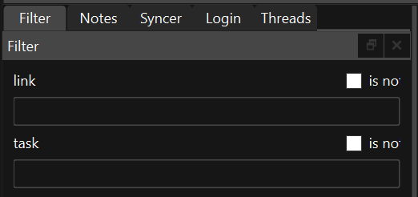
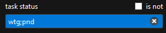
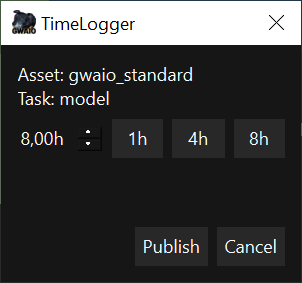

# Paneles principales 
## Panel de Tareas 

El **"Panel de Tareas"** muestra la información relativa a las tareas creadas para cada proyecto.   
Esta información se muestra en forma de tabla, donde cada tarea es una fila y cada columna son los datos con los que se pueden filtrar las tareas con los filtros que hay en el **"Panel de Filtros"**.  
Las teclas de control y shift funcionan igual que en el explorador de windows y permite seleccionar varias tareas.  

Además, tenemos la funcionalidad de poder usar un buscador rápido utilizando el atajo de teclado Ctrl+F sobre el panel de tareas.

## Panel de Ficheros 

El **"Panel de Ficheros"** muestra los ficheros existentes en el sistema de ficheros local para la tarea que haya seleccionada en el **"Panel de Tareas"**. Si no hay ninguna tarea seleccionada, este menú  muestra el sistema de ficheros de la última task seleccionada (o vacío en el caso de que no se hubiera seleccionado ninguna tarea aún en la sesión activa). A continuación, se muestran dos imágenes:
 * La primera imagen muestra el **"Panel de Ficheros"** con ninguna tarea seleccionada

  

 * La segunda imagen muestra el **"Panel de Ficheros"** con una tarea seleccionada. Si se seleccionan varias tareas, el **"Panel de Ficheros"** muestra la última tarea seleccionada. 

Adicionalmente el **"Panel de Ficheros"** tiene una barra de navegación y tres botones:
 * Subir: Este boton nos lleva a la carpeta padre del path actual.
 * Refrescar: Fuerza un refrescado de los datos que hay en el panel.
 * Renombrar: Herramienta para renombrar un archivo seleccionado.

Si se pone una dirección válida y se pulsa la tecla **"Enter"**, el **"Panel de Ficheros"** se actualiza a la ruta escrita. 

## Funciones adicionales
Este panel tiene funcionalidades similares a la de cualquier explorador de archivos:  
1. Haga doble click para abrir un archivo
2. Presione Ctrl+Click para seleccionar varios archivos 
3. Presione Alt+Click para seleccionar el conjunto de archivos comprendido entre ambos clics. 
4. Arrastre un archivo dentro del panel para copiarlo dentro de la carpeta seleccionada en el explorador de ficheros 
5. Seleccione y arrastre un archivo del explorador de ficheros a una ventana externa al programa para moverlo/utilizarlo. 
6. Los archivos mal nombrados se muestran con el texto de color rojo. 

# Paneles secundarios 

Los paneles secundarios tambien llamados **"docks"** muestran información adicional de las tareas y contienen herramientas de utilidad para facilitar el trabajo. 

  
*Algunos paneles secundarios agrupados.* 

Estos paneles y barras de herramientas se pueden ocultar, mostrar, agrupar o desacoplar de la interfaz o mover de posición al gusto del usuario: 

* Si desea convertir un panel en flotante, haga clic en la barra de título y arrastre el panel a otra ubicación. Otro método para desacoplar un panel de forma automática es hacer doble clic en el título del panel. 

* Si desea acoplar un panel flotante, haga clic en la barra de título del panel y arrastre hacia otro panel hacia el borde de la ventana. Otro método para acoplar un panel de forma automática es hacer doble clic sobre la barra de título del panel. 

* Para mostrar/ocultar los paneles, haga clic en View, que se encuentra en la barra de menú en la parte superior de la ventana, y seleccione o deseleccione los paneles que desee modificar. 

## Panel de Configuración 

En este panel puede ver la información de la configuración del programa. Generalmente no se debería editar directamente, ya que se edita automáticamente con el uso del propio programa. 

## Panel de Filtrado 

Permite al usuario filtrar las tareas visibles en el **"Panel de Tareas"**. Hay un filtro por cada columna que aparece en este panel. Los filtros se pueden combinar entre sí. Cuando un filtro este activo su campo de texto es de color azul. 

 

Active la casilla **"is not"** para invertir el filtro. Esta acción hace que se invierta su funcionamiento y nos muestre las tareas que no contengan el texto introducido en el filtro. Esta acción cambia el color del campo del filtro a marrón. 

  
 

Haga clic en el icono de la **"x"** situado a la derecha del filtro para borrar por completo el texto. Alternativamente también puede el usuario borrarlo manualmente con las herramientas comunes de edición de texto. 

Los filtros tienen un sistema para autocompletar. Puede añadir varios tags de filtro separándo dichos tags con el signo **";"**. 

 

Si el usuario activa la casilla **"is not"** y deja vacío el filtro, el "Panel de Tareas" no mostrará ninguna tarea. 

## Panel de Hilos 

Panel técnico donde se muestra el listado de todos los hilos de proceso abiertos, finalizados y a la espera en el programa. No es relevante para el usuario. 

 
 
 

## Panel de Sincronización 

Panel técnico donde se muestra el log de los archivos y carpetas sincronizadas. Además, este panel contiene los mismos botones de sincronizado de la **"Barra de herramientas de sincronización"**. 

## Panel de Reproducción 

Reproductor y visualizador de contenido multimedia. Reproduce el último fichero seleccionado en el "Panel de Ficheros". También reproduce la miniatura (si la hay en el sistema de ficheros local) de la última tarea seleccionada. 

## Panel de syncronizado 

En este panel podemos configurar una serie de filtros para que el sincronizador excluya ciertos ficheros o fuerce a sincronizar algun fichero en concreto, además se puede limitar la cantidad de archivos a sincronizar.
 * Include: Sincroniza unicamente los archivos que contiene el texto del recuadro.
 * Exclude: Excluye del sincronizado los archivos que contiene el texto del recuadro.
 * Limit: Limita el numero de archivos sincronizados. Este limite se aplica por extensión de los archivos. Es decir, si existe para sincronizar 4 archivos .ma y 4 archivos .mov y ponemos un limite de 2, se sincronizarán los 2 últimos .ma y los dos últimos .mov.

 

## Panel de Notas 

Panel que recoge todas las notas que contenga la tarea seleccionada en el **"Panel de Tareas"**. Haga clic en una nota o imagen para abrirla en el navegador web. Adicionalmente, en la parte superior del panel se muestra la descripción de la tarea, si la tiene. 

## Panel de Versiones

Panel que recoge todas las versiones que contenga la tarea seleccionada en el **"Panel de Tareas"**.

## Panel de Renombrado

Herramienta de renombrado de archivos en lote. Para añadir o quitar archivos del lote que se va a procesar en la herramienta seleccione o deseleccione los archivos que desee en el panel del explorador de ficheros. 

  

* Prefix: añade el texto escrito en este campo al comienzo del nombre de todos los archivos seleccionados. 

* Suffix: añade el texto escrito en este campo al final del nombre de todos los archivos seleccionados. 

* Delete: elimina del nombre de los archivos seleccionados el texto escrito en el campo. 

* Replace: reemplaza del nombre de los archivos seleccionados el texto introducido en el campo de la izquierda por el texto introducido en el campo de la derecha. 

* Extension: reemplaza la extensión de los archivos seleccionados por la que se escribe en el campo. 

## Panel de Publicado 

Herramienta para publicar nuevas versiones en la base de datos del plugin. Adicionalmente trata de sincronizar los archivos locales con los del servidor, y si el plugin tiene habilitada la opción, da la posibilidad de empaquetar automaticamente los archivos seleccionados y subirlos a la base de datos. 

 

Existen dos formas de ejecutar la herramienta: 

* Para publicar archivos específicos de una tarea siga estos pasos: 

  * Antes de abrir la herramienta, seleccione los ficheros a publicar en el **"Panel de ficheros"**. 

  * Después abra la herramienta 

* Para publicar archivos de varias tareas siga estos pasos: 

  * Antes de abrir la herramienta, seleccione la tarea a publicar en el **"Panel de tareas"**. Después abra la herramienta. 

Una vez abierta la herramienta, se mostrarán los ficheros que se van a publicar. Esta herramienta muestra distintos campos de información: 

* En la parte superior se detalla la información de la tarea en la que se va a publicar los ficheros seleccionados. 

* Publish: checkbox para activar o desactivar la publicación de un fichero. Si la casilla está activa, el color del campo es azul y el archivo se publicará. Si la casilla está desactivada, el color del campo es blanco y el archivo no se publicará. 

* Status Publish: estado actual de la publicación del archivo.  

  * "Publish succesful" indica que el archivo ya ha sido publicado. **Los archivos publicados no se pueden volver a publicar.** 

  * "N/A" indica que el archivo no es compatible para ser publicado. 

  * "Not published" indica que el archivo no ha sido publicado anteriormente. 

* Status Sync: estado actual de la sincronización del archivo.  

  * "Not Synced" indica que el archivo no ha sido sincronizado en el servidor. 

  * "Sync succesful" indica que el archivo ya se encuentra sincronizado en el servidor. 

* Thumbnail: previsualización del archivo a publicar. 

* Path: nombre del archivo a publicar. 

* En la parte inferior añada la descripción que desee para su versión. 

* Presione el botón "Publish" para publicar. Al finalizar el proceso, la ventana se cerrará automáticamente. 

 

Para que la publicación se pueda realizar, deberá rellenar toda la información necesaria, en caso de que falte información, la interfaz mostrará un borde de color rojo sobre el campo que requiera información.

 

Una vez finalizado el proceso de publicación, aparecerá una ventana que nos confirma que el proceso se ha realizado correctamente.

> **NOTA: esta herramienta requiere de acceso a su servidor y de conexión a internet para su correcto funcionamiento. Por favor, asegúrese de que cumple estos requisitos para su uso.**

> **NOTA: los archivos publicados en la base de datos no se pueden volver a publicar.**

## Panel de Concatenar (Obsoleto)

Herramienta para concatenar múltiples archivos multimedia en un único archivo de video. 

Para añadir los archivos con los que la herramienta va a trabajar, haga clic en uno de los tres métodos que se encuentran en la parte superior de la ventana. 

* Add Files from Folder: abre una ventana de selección de carpetas. Añade los archivos que contiene las carpetas seleccionadas en la anterior ventana. 

* Add Files from selected Task: añade todos los archivos que contenga la tarea seleccionada en el panel de Tareas. 

* Add Files from selected Files: añade todos los archivos seleccionados en el panel de explorador de ficheros. 

El panel central de la herramienta se compone de dos columnas. La primera muestra un checkbox para activar o desactivar su uso en el proceso de concatenado. Si el checkbox está activo en el archivo, la herramienta usara el fichero. En cambio, si el checkbox está desactivado, la herramienta omitirá el archivo durante el proceso de concatenado.  

La segunda columna del panel central de la herramienta muestra el nombre de los ficheros importados. 

En la parte inferior del panel encontramos dos opciones: 

* Duration image: seleccione los segundos que desee que dure las imágenes estáticas en el video concatenado. 

* Output video: inserte la ruta y nombre de la salida del video final. Haga clic en la carpeta para navegar por el explorador de archivos y seleccionar la carpeta de salida. 

Por último, presione el botón generar para empezar el proceso de creación del video. 

## Panel de BDL 

Herramienta para la creación por lotes de assets dada una BDL en Shotgrid. 

Este panel tiene 3 botones: 

* **Load XLSX:** te permite cargar un archivo xlsx que siga el patrón para el cual ha sido diseñado el plugin de proyecto. Cuando se carga la BDL, aparece una lista con los assets que se van a crear. 

  * 

  * Las filas en verde indican que ya han sido creados y que existen en la base de datos. 
  * 
  * Las filas en rojo indican que hay algún tipo de problema, haciendo doble clic en la fila, se indica que problema hay: 

 

  * Para subsanarlo se tiene que eliminar este fallo de la BDL (xlsx) y cargarlo de nuevo. 

* **Upload to SG:** sube los assets que no estén ni en rojo ni en verde a la base de datos. 

* **Upload selected to SG:** sube los assets seleccionados y que no estén ni en rojo ni en verde a la base de datos. 

> **Nota: Los assets que estén en verde y que se intenten subir actualizarán algunos datos, en el caso de que se aplique y en el case de que algunos datos no sean iguales en el XLSX y en la base de datos. Generalmente esto se aplica a la columna de Description.** 

## Panel de EDL 

Herramienta para la creación por lotes de shots en Shotgrid dado un fichero EDL. En esta ventana nos encontraremos 5 botones.

* **LOAD EDL/XML:** Este botón permite añadir los datos necesarios para poder trabajar con la herramienta:
  * 1.- Seleccione el archivo EDL.
  * 
  * 2.- Seleccione el archivo de video correspondiente a la EDL.
  * 
  * 3.- Seleccione el episode/sequence con la que quiere trabajar.
  * 
  * 4.- Seleccione la tarea en la que quiere trabajar.
  * 
  * 5.- Una vez realizados todos los pasos tendremos la información en la ventana:
  * 
* **Split video:** Con los datos cargados, podemos utilizar esta botón para recortar los shots del video dado. A través de los datos de la EDL GwaIO recortará los shots seleccionados en la ventana y los guardará en formato mov y wav.
* **Copy files to server:** Copia los archivos generados con el **"Split video"** al servidor.
* **Upload to SG:** Genera los shots en Shotgrid si no existen y sube los videos recortados en la tarea seleccionada.

## Panel de Timelog 

Este panel sirve para marcar el timelog de la task seleccionada en Shotgrid.

# Tools

### Tool Download playlist version 

Herramienta para descargar los archivos de las versiones que contenga una Playlist de Shotgrid. 

1. Select Playlist: seleccione la playlist de la que quiere descargar las versiones. 

2. Output folder: seleccione la carpeta donde quiera guardar los archivos de la descarga. 

3. Generate edit with download files: seleccione esta opción si desea hacer un video concatenando todos los archivos descargados. 

4. Haga clic en el botón **"Download"** para comenzar el proceso 

### Tool Download Package

Ventana que nos muestra el listado de packages publicados en shotgrid. Esta ventana nos permite filtrar por nombre en caso de que deseemos un package en especifico. Esta herramienta nos descargará y ordenara en su ubicación correspondiente todos los archivos contenidos en el Package.

### Tool Job Manager (Experimental)

Herramienta en fase de desarrollo con la que gestionar los jobs que se envian miendiante la **"Toolbar de Jobs"**. En este panel encontraremos la información de cada uno de los jobs que tenemos en la farm nativa de GwaIO

Para acceder a esta herramienta haga clic en menu de la **"Barra de Menus"** View > Job Viewer

### Tool Broker (Experimental)

La herramienta de Broker simplemente se usa para activar el pc como un nodo de trabajo en la farm de GwaIO. Una vez activa la tool en el pc, comenzará a realizar las tareas que se encuentren en la **"Tool Job Manager"**.

Para acceder a esta herramienta haga clic en menu de la **"Barra de Menus"** View > Brocker Dock

### Toolbar de Jobs

Esta toolbar contiene botones con los que abrir el lanzador de jobs a la farm interna de GwaIO. Los componentes de esta toolbar dependerán del proyecto y de las necesidades que tenga.

### Tool Launch Job

Esta herramienta se abre mediante los botones que contiene la **"Toolbar de Jobs"**. Haga clic en el launcher deseado y a continuación se mostrara esta ventana:

La herramienta de Launch Job se compone de una serie de opciones para poder configurar nuestro job:

 * Seleccione el tipo de job que desea lanzar a farm
 * Si es necesario, seleccione el archivo de input que requiere el job. Alternativamente, puede seleccionar el archivo en el **"Panel de explorardor"** previamente a abrir la herramienta.
 * Si lo desea, puede guardar un preset con la configuración del job para posteriormente poder seleccionar el preset deseado y no tener que configurar los valores a mano.
 * Configure las opciones con los parametros deseados.
   * Puede usar tags para automatizar el valor deseado en funcion a los valores de la tarea/proyecto. Por ejemplo, puede utilizar el tag de <cut_duration> para seleccionar el valor de duración que contiene la tarea.
   * Para ver el listado de tags haga clic en el botón de la derecha de cada opción.
   * Para previsualizar el resultado del tag mantenga el ratón sobre el boton de tags
   * Para ver la descripción de cualquier parametro mantenga el ratón sobre el cuadro de texto del valor del parametro.
 * Por último, haga clic en "Create Job" para lanzar el job a la farm.